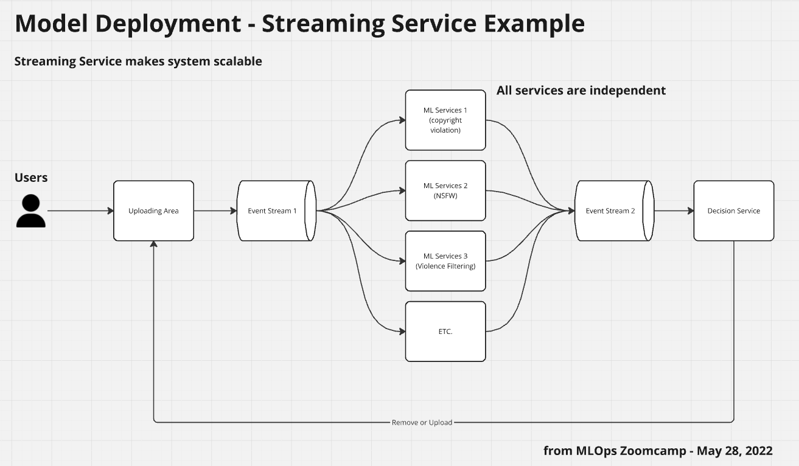

# MLOps Zoomcamp Note

*MLOps = a set of best practice to putting Machine Learning to production*

General 3 stages of Machine Learning Project
1. Design: consider if machine learning is suitable to solve the problem
2. Train: Experiment Models
3. Operate: Deployment, Monitor model's performance

## Table of Contents
- [1.2 Environment Preparation](#12-environment-preparation)
- [1.3 (Optional) Training a ride duration prediction model](#13-optional-training-a-ride-duration-prediction-model)
- [1.4 Course Overview](#14-course-overview)
- [1.5 MLOps Maturity Model](#15-mlops-maturity-model)
- [2.1 Experiment Tracking Intro](#21-experiment-tracking-intro-mlflow)
- [2.2 Getting started with MLflow](#22-getting-started-with-mlflow)
- [2.3 Experiment tracking with MLflow](#23-experiment-tracking-with-mlflow)
- [2.4 Model Management](#24-model-management)
- [2.5 Model Registry](#25-model-registry)
- [2.6 MLflow in practice](#26-mlflow-in-practice)
- [2.7 MLflow Benefits, Limitations, and Alternatives](#27-mlflow-benefits-limitations-and-alternatives)
- [3.0.1 Machine Learning Pipeline](#301-machine-learning-pipeline)
- [3.0.2-3.5.x Setup Mage and Hands-on](#302-35x-setup-mage-and-hands-on)
- [4.1 Model Deployment Overview](#41-model-deployment-overview)
- [4.2 Web-services: Deploying models with Flask and Docker](#42-web-services-deploying-models-with-flask-and-docker)
- [4.3 Web-services: Getting the models from the model registry (MLflow)](#43-web-services-getting-the-models-from-the-model-registry-mlflow)

## 1.2 Environment Preparation

In the video, Alexey recommended to use linux operating system (EC2 in demonstration)
- Manually creating an instance on AWS cloud
- Creating "Key Pair", download it and place in ~/.ssh path
- specify instance's spec & launch
- Copying Public IP address then go to local terminal
    ```bash
    # username: ubuntu in demonstration
    ssh -i ~/.ssh/key_pair.extension <username>@<copied IP address>

    # connected to the remote instance
    ```
    - but we don't have to execute this bash command every time to connect to the remote instance, do this in local machine
    ```bash
    nano .ssh/config/
    
    # specify config
    Host <host-name>
        HostName <Public IP Address>
        User <Username>
        IdentityFile <Full Path to key-pair file location> 
        StrictHostKeyChecking no

    # then save and exit
    ssh <host-name>
    ```
- Installing py env (preparing python environment)
    ```bash
    wget <link to anaconda linux installer (.sh)>
    bash <downloaded .sh file>
    ```
- To open some service liek jupyter notebook, we might need to access via port such as "htpp://localhost:8888". We need to forward port before, which is very easy to do via vscode `PORT`.

## 1.3 (Optional) Training a ride duration prediction model
- Saving ML model
    ```python
    import pickle

    # from ... import model
    # model.fit(x_train, y_train)
    # dv = DictVectorizer().fit(...)

    with open("models/lin_reg.bin", "wb") as f_out:
        pickle.dump((dv, model), f_out)
    ```
- There're always DS' notebook where the model is developed is typically not well-arranged and not applicable in production.

## 1.4 Course overview
- Experiment Tracking and Model Management --> MLflow
- ML Pipeline --> Prefect & Kubeflow
    - Parameterized
- Model Deployment & Serving (used as a service)
- Monitoring and automatically Re-train model

## 1.5 MLOps Maturity Model
- Level-0: No MLOps 
    - No automation, All code in Jupyter Notebook (PoC)
- Level-1: DevOps, but No MLOps
    - What are included
        - Releases are automated
        - Unit & Integration Tests
        - CI/CD
        - OPs Metrics (Request workload & Network aspect)
    - What are not included
        - No Experiment Tracking
        - No Reproducibility
        - Data Scientists are separated from Engineers
- Level-2: Automated Training
    - Infrastructure
        - Trainning Pipeline
        - Experiment Tracking
        - Model Registry
    - Low Friction Deployment (maybe just bump version on platform)
    - DS works with Engineer Team
- Level-3: Automated Deployment
    - Easy to Deploy model
    - Full ML Pipeline: Data prep. -> Train Model -> Deploy model
    - A/b Testing
    - Model Monitoring
- Level-4: Full MLOps Automation
    - Automatic Train / Re-train / Deployment

## 2.1 Experiment Tracking Intro (MLflow)
- Install and how to use MLflow
- Important concept:
    - ML experiment: the process of building an ML model
    - Experiment run: each trial in an ML experiment
    - Run artifact: any file that is associated with an ML run
    - Experiment meta data
- Experiment tracking
    - Source code
    - Environment
    - Data
    - Model
    - Hyperparameters
    - Metrics
    - ...
    - For:
        - Reproducibility
        - Organization: finding information of this and that that we have developed before.
        - Optimization: tune to be a better ML model
- MLflow
    - open source platform for the machine learning lifecycle
    - A simple python package: `pip install mlflow`
    - components:
        - Tracking
        - Models
        - Model Registry
        - Projects
    - MLflow module allows you to organize your experiments into runs and keep track of
        - Parameters
        - Metrics
        - Metadata
        - Artifacts
        - Models
    
## 2.2 Getting started with MLflow
- To install dependencies that require for the project, you have to install it with `requirements.txt`, but the best practice is to use separated python environment such as conda or venv (virual env) to not mess up with packages installed in the local configuration.

```bash
conda create -n <environment-name> python=3.9

conda activate <environment-name>

# you will see something like (<environment-tracking-env> -> ...) in terminal
pip install -r requirements.txt

pip list

mlflow --version

# mlflow ui

# mlflow ui with backend database
mlflow ui --backend-store-uri sqlite:///mlflow.db

# then copy a given local ip address (and port) and open in the browser
```

*Note: **venv** vs **Conda***
| venv | conda |
|:-:|:-:|
| light weight | data-sci lib included as default|
| Pure Python Project | Accept Multi-language Project |

- To set mlflow tracker, go to notebook developing ML model
    ```python
    import mlflow

    mlflow.set_tracking_uri("sqlite:///mlflow.db") # it will try to save artifact to this db
    mlflow.set_experiment("custom-experiment-name")
    
    # develop your model in the notebook with mlflow lib
    with mlflow.start_run():
        
        mlflow.set_tag("developer", "dev_name") # this may be useful for a large team
        mlflow.log_params("train-data-path", "./path/to/data.parquet")
        mlflow.log_params("val-data-path", "./path/to/data.parquet")

        alpha = 0.1
        mlflow.log_params("alpha", alpha)
        
        lr = model(alpha)
        lr.fit(X_train, y_train)

        y_pred = lr.predict(X_val)
        rmse = mean_squared_error(y_val, y_pred, squared=False)
        mlflow.log_metric("rmse", rmse)
    ```
    - then go check experiment in mlflow UI 


## 2.3 Experiment tracking with MLflow
- Using tag is useful when you monitor the experiment and filter the model
- Using `compare` feature to visualize correlation of hyperparameters combination from search space that result the metric we specified.
- mlflow `autolog`

## 2.4 Model Management
- To avoid error prone by manually write it down somewhere or create confusing folders to contain different versions of model, use model logging from MLflow.
- log model
    1. `log artifact`, considering your model as another artifact from the run. It's not quite very useful.
        ```python
        # import mlflow
        import pickle

        # mlflow.set_tracking_uri("sqlite:///mlflow.db") # it will try to save artifact to this db
        # mlflow.set_experiment("custom-experiment-name")
        
        # develop your model in the notebook with mlflow lib
        # with mlflow.start_run():
            
            # mlflow.set_tag("developer", "dev_name") # this may be useful for a large team
            # mlflow.log_params("train-data-path", "./path/to/data.parquet")
            # mlflow.log_params("val-data-path", "./path/to/data.parquet")

            # alpha = 0.1
            # mlflow.log_params("alpha", alpha)
            
            # lr = model(alpha)
            # lr.fit(X_train, y_train)

            # y_pred = lr.predict(X_val)
            # rmse = mean_squared_error(y_val, y_pred, squared=False)
            # mlflow.log_metric("rmse", rmse)

            # save the model
            with open("models/lin_reg.bin", "wb") as f:
                pickle.dump(lr, f)
            f.close()

            mlflow.log_artifact(local_path="models/lin_reg.bin", artifact_path="model_pickle/")
        ```
        - And now, you can see your local saved model in MLflow UI in "Artifacts" section. (we save the local saved model to MLflow *Artifacts*)
    2. `log model`, store more information about the model, and be later loaded easily.
        ```python
        # import mlflow

        # mlflow.set_tracking_uri("sqlite:///mlflow.db") # it will try to save artifact to this db
        # mlflow.set_experiment("custom-experiment-name")
        
        # develop your model in the notebook with mlflow lib
        # with mlflow.start_run():
            
            # mlflow.set_tag("developer", "dev_name") # this may be useful for a large team
            # mlflow.log_params("train-data-path", "./path/to/data.parquet")
            # mlflow.log_params("val-data-path", "./path/to/data.parquet")

            # alpha = 0.1
            # mlflow.log_params("alpha", alpha)
            best_params = {
                "learning_rate": 0.06,
                "max_depth": 30,
                "min_child_weight": 1.06,
                # etc
            }

            mlflow.log_params(best_params)
            
            # lr = model(alpha)
            # lr.fit(X_train, y_train)

            # y_pred = lr.predict(X_val)
            # rmse = mean_squared_error(y_val, y_pred, squared=False)
            # mlflow.log_metric("rmse", rmse)

            booster = xgb.XGBoostClassifier(...)
            mlflow.xgboost.log_model(booster, "models_mlflow")
        ```
        - The model is not xgboost, but the tutorial is. MLflow has multiple supported library to work with "log_model", check it out here: https://mlflow.org/docs/latest/models.html
        - Run, then check the UI, you will see the latest train model's detail is very well logged with parameters, metrics, saved model, and even project dependencies (as we specify in `conda` or `requirements.txt`)
        - In model folder detail, it will contain code snippet of how the saved model can be used or called from MLflow to predict on any new data.

## 2.5 Model Registry

Model Registry is a place in which all the models that are production-ready should be stored (it do not deploy anything).

Tracking Server (model run 1/2/3) >> ***Register Model*** >> Model Registry (staging/production/archive)

- promoting different model to the same model name, resulting in the new version of the model in the registry
- we can assign the stage for the models such as `Staging`, `Production`, `Archive` from `None` via mlflow UI

### MLflow Client
We are able to use MlflowClient class to interact with object in Mlflow besides WebUI
```python
from mlflow.tracking import MlflowClient

# instead of sqlite for local, this can be URL for remote server
MLFLOW_TRACKING_URI = "sqlite:///mlflow.db"

client = MlflowClient(tracking_uri=MLFLOW_TRACKING_URI)

# request general detail
client.list_experiments()

client.create_experiment(name="custom-name-experiment")

# from mlflow.entities import ViewType
runs = client.search_runs(
    experiment_ids = '1'
    filter_string = "",
    # filter_string = "metrics.rmse < 6.8", # filtering
    run_view_type = ViewType
    max_results=5,
    order_by=["metrics.rmse ASC"]
)

for run in runs:
    print(f"run id: {run.info.run_id}, rmse: {run.data.metrics['rmse']:.4f}")


# promoting to model registry
import mlflow

mlflow.set_tracking_uri(MLFLOW_TRACKING_URI)

# specify model performance condition
runs = client.search_runs(
    experiment_ids = '1'
    filter_string = "metrics.rmse < 6.8", # filtering
    run_view_type = ViewType
    max_results=5,
    order_by=["metrics.rmse ASC"]
)

# register the model
run_id = runs[0]
model_uri = f"runs:/{run_id}/model"
mlflow.register_model(
    model_uri=model_uri,
    name="register-model-name"
)


# transitioning a model from one stage to another
client.list_register_models()

model_name = "register-model-name"
latest_versions = client.get_latest_versions(name=model_name)

# check stage
for version in latest_versions:
    print(f"version: {version.version}, stage: {version.current_stage}")

# transition the model
model_version = 4
new_stage = "Staging"
client.transition_model_version_stage(
    name=model_name,
    version=model_version,
    stage=new_stage,
    archive_existing_versions=False
)

# annotate the model
client.update_model_version(
    name=model_name,
    version=model_version,
    description=f"The model version {model_version} was transitioned to {new_stage}"
)


# using components on Mlflow via Client in action!
# define utils function
def read_dataframe(file_name):
    df = pd.read_csv(filename)
    
    df.lpep_dropoff_datetime = pd.to_datetime(df.lpep_dropoff_datetime)
    df.lpep_pickup_datetime = pd.to_datetime(df.lpep_pickup_datetime)
    
    df["duration"] = df.lpep_dropoff_datetime - df.lpep_pickup_datetime
    df.duration = df.duration.apply(lambda td: td.total_seconds() / 60)

    df = df[(df.duration >= 1) & (df.duration <= 60>)]

    categorical = ["PULocationID", "DOLocationID"]
    df[categorical] = df[categorical].astype(str)
    
    return df

def preprocess(df, dv):
    # for ny-taxi dataset as shown in the video
    df['PU_DO'] = df['PULocationID'] + '_' + df['DOLocationID']
    categorical = ['PU_DO']
    numerical = ['trip_distance']
    train_dicts = df[categorical + numerical].to_dict(orient='records')
    return dv.transform(train_dicts)

def test_model(stage, X_test, y_test, name='register-model-name'):
    model = mlflow.pyfunc.load_model(f"models:/{name}/{stage}")
    y_pred = model.predict(X_test)
    return {"rmse": mean_squared_error(y_test, y_pred, squared=False)}

# load data
df = read_dataframe(filename)

# load fitted vectorizer to local
client.download_artifact(
    run_id = run_id,
    path='preprocessor',
    dst_path='.'
) # assume this will provide output path: 'preprocessor_path.b'

# assign preprocessor
with open("preprocessor_path.b", "rb") as f_in:
    dv = pickle.load(f_in)

X_test = preprocess(df, dv)

target = "duration"
y_test = df[target].values

# inference
score = test_model(name=model_name, stage="Staging", X_test=X_test, y_test=y_test)

print(score_dict)

# assume we're happy with the model in staging and want to transition to 'Production'
# transition the model
client.transition_model_version_stage(
    name=model_name,
    version=4,
    stage='Production',
    archive_existing_versions=True
)
```

In conclusion
The model registry component is a centralized mode lstore, set of APIs and a UI to collaboratively manage the full lifecycle of an MLflow Model.

It provides:
- Model lineage
- Model versioning
- Stage transitions
- Annotations

## 2.6 MLflow in practice
### Configuring MLflow
- Backend Store
    - Local Filesystem
    - SQLAlchemy Compatible DB (e.g. SQLite)
- Artifacts store
    - Local Filesystem
    - remote (e.g. s3 bucket)
- Tracking Server
    - no tracking server
    - localhost
    - remote

Consider these different scenarios to adopt MLflow:
1. A single data scientist working on an ML model.
    - Configurations
        - Backend Store: local filesystem
        - Artifacts Store: local filesystem
        - Tracking Server: no need
    - Remark
        - Even we don't enable tracking server, we are still able to use `mlflow ui`.
        - `mlflow ui` search the current working directory for *"mlrun"*. In case you re-structure your project, you must `cd` to the working directory that contains *mlrun* with a custom path, and then `mlflow ui` again.
        - Tips: In case you can't access `localhost` with access denied in web browser, just clear cookies and refresh the page.
2. cross-functional team working on an ML model (even with one data scientist to show the progress or tracking performance for the team).
    - Configurations
        - Backend Store: local.server
        - Artifacts Store: sqlite databse / Cloud
        - Tracking Server: localfile system
    - Remark:
        - You can run the tracking server locally by
            ```bash
            # mlflow server --backend-store-uri <backend-uri> --default-artifact-root <artifacts-path>
            mlflow server --backend-store-uri sqlite://backend.db --default-artifact-root ./artifacts_local
            ```
        - Setting `set_tracking_uri` would be localhost URL with a specific port
3. Multiple data scientists working on multiple ML models.
    - Configurations
        - Backend Store: postgres database (RDS)
        - Artifacts Store: Data Lake (S3 or GCS or blob storage)
        - Tracking Server: remote server (could be EC2)
    - Remark:
        - Setting up EC2 instance,
            ```bash
            sudo yum update
            pip3 install mlflow boto3 psycopg2-binary
            aws configure # For AWS authentication
            mlflow server -h 0.0.0.0 -p 5000 --backend-store-uri postgres://DB_USER:DB_PASSWORD@DB_ENDPOINT:5432/DB_NAME --default-artifact-root s3://S3_BUCKET_NAME
            ```
            - go to URL: "http://<EC2_PUBLIC_DNS>:5000"
        - For AWS, you need "key-pair" to login through ssh into the instance as a credential.
        - Connection between RDS and EC2
            - In order to make EC2 can communicate with RDS, you need to add an inbound rule with PostgreSQL type, and the same security group with EC2's.
            - Copy RDS's endpoint and initialize session through EC2 with the MLflow command replaced backend-store-uri with created user, password and endpoint of the created RDS.
        - Use **Public IPv4 DNS** to connect to deployed MLflow.
        - `mlflow.get_tracking_uri()` is a good way to check if we specified a correct tracking server host's public DNS in setting uri part (`mlflow.set_tracking_uri(f"http://{TRACKING_SERVER_HOST}:5000")`).
        - AWS resources:
            - instances/cluster: EC2
            - Data Lake: S3
            - Backend Database: RDS
For each run:
- Set Experiment
- Start run
- Log
    - Log Params
    - Log metric
    - Log model

## 2.7 MLflow Benefits, Limitations, and Alternatives
- Remote Tracking Server
    - Benefits
        - Sharing experiments with other data scientist
        - Collaborate with others (MLE, SRE) to build and deploy models
        - Give more visibility of the DS effort
    - Potential Issues
        - Security
            - Restrict access to the server (e.g. access through VPN)
        - Scalability
        - Isolation
            - All the artifacts will get messy quickly without stardard for naming experiment when working in multiple teams or tags, so it should be well-managed to make your artifact available to exploit.
            - All artifacts should be managed by different s3 bucket live on different account to avoid access restriction.
    - Limitations (and when not to use it)
        - Authentication & Users
            - The open source version of MLflow doesn't provide any sort of authentication
        - Data versioning
            - For the sake of reproducibility, data versioning is important, but MLflow doesn't provide build-in solution for the open source version.
        - Model/Data Monitoring & Alerting
            - This is out of scope of MLflow.
- MLflow alternatives
    - Neptune
    - Comet
    - Weights & Biases
    - and more

## 3.0.1 Machine Learning Pipeline
*A.K.A. Workflow Orchestration*
- A Sequence of steps to reproduce something (and for ML pipeline, of courc, reproducing an ML model)
- There're multiple tools can be mentioned here, some could be for general purpose, and some could be more specific to ML Pipeline.
    - More General
        - Airflow
        - Prefect
        - Mage
    - More specific to ML
        - Kubeflow pipelines
        - MLflow pipelines

## 3.0.2-3.5.x Setup Mage and Hands-on
TBD

## 4.1 Model Deployment Overview
- Design, Train (Experiment tracking + Training Pipeline), ***Operate***
- Types of deployment depends on requirement or how output would be used
    1. **Batch Deployment / Offline Deployment**
        - Model is not up and running all the time, we just apply our model to new data regularly (hourly, daily, monthly, etc.)
    2. **Online Deployment**
        - The model is always available, running up all the time
        - sub-types of online deployment
            1. Web Services (through HTTP request)
            2. Streaming (through stream of events)

### 1. Batch Deployment
- Database (historical data) -> ML services -> Database containing prediction
- Real-time Prediction is not necessary
- Example use case:
    - Marketing aspect, in term of churn prediction. We might not have to know immediately if the user is going to churn at the time, but we might need to predict whether the user is likely to churn and then we might give them some incentive after. It's just fine with daily batch or longer time interval for schedule.

### 2. Online Deployment
1. Web Service
    - The model needs to be up and running all the time, because user might want to decide action from prediction
    - Example use case:
        - Taxi App might have a backend service that communicates with ride duration prediction service. User may want to know ride duration, or how much it will cost immediately before decide to request the taxi from the app.
2. Streaming Service
    - consist of producer and consumer, producer push some event to an event stream and then consumer read from this stream and react to these events by doing something.
    - Backend now become the producer sending events to ML services which is independent consumers of that event stream.
        - One thing in the video that's interesting is web service and streaming service can be in the same system, but used in different purpose. For example, web service may handle the ride duration prediction first for user decision to request the taxi, but after user request, we might need more accurate model to infer ride duration for the user.  
    - The key difference between streaming service and web service is that streaming service (producer) pushs the event to the event stream and it doesn't really care what will be happened after, because producer and consumer don't have explicit connection between them ,unlike webservice which rely on API.
    - Example use cases:
        - Uploading Youtube video and searching for inappropriate content, "content moderation".
        - Recommendation services after the video upload to Youtube.
        

## 4.2 Web-services: Deploying models with Flask and Docker
1. Example of Flask app
    ```python
    # predict.py
    import pickle
    from flask import Flask, request, jsonify # request not requests


    with open("model/lin_reg.bin", "rb") as f_in:
        (vectorizer, model) = pickle.load(f_in)

    def pre_processing_input(input_features):
        features = {}
        # some feature engineering process, encoding, and transformation
        # features["feature_A"] = ...
        # features["feature_B"] = ...
        # features["feature_C"] = ...
        return features

    def predict(features):
        X = vectorizer.transform(features)
        y_pred = model.predict(X)
        return y_pred[0] # [0] for float (item in Sequence), since y_pred: numpy.array


    app = Flask("app-name")

    @app.route('/predict', method=['POST'])
    def predict_endpoint():
        input_features = request.get_json()

        features = pre_processing_input(input_features)
        y_pred = predict(features)

        result = {
            "target_feature": y_pred
        }

        return jsonify(result)


    if __name__ = "__main__": # this block only used for local development (run locally)
        app.run(debug=True, host="0.0.0.0", port=9696)
    # for producttion, we use gunicorn
    ```
    - gunicorn
        ```bash
        gunicorn --bind=0.0.0.0:9696 predict:app
        ```

2. Example of request test script
    ```python
    # test.py
    import requests


    URL = "http://localhost:9696/predict" # endpoint name
    input_features = {
        "feature_A": 10   
        "feature_B": 50
        "feature_C": "x"
    }

    response = requests.post(URL, json=input_features)
    print(response.json())
    ```

3. Example of Dockerfile for Flask app
    ```dockerfile
    FROM python:3.9.7-slim # light-weighted python version

    RUN pip install -U pip # some module required the latest pip v. e.g. xgboost
    RUN pip install pipenv # virtual py env

    WORKDIR /app

    COPY [ "Pipfile", "Pipfile.lock", "./" ]

    RUN pipenv install --system --deploy

    COPY [ "predict.py", "lin_reg.bin", "./" ]

    ENTRYPOINT [ "gunicorn", "--bind=localhost:9696", "predict:app" ]
    ```
- ***Remark***: This chapter often mentioned ML-Zoomcamp about how to productionize Docker Containerized application, such as using **Kubernetes**, or AWS Elastic Beanstalk. Maybe, it's a good idea to check it out:
    - [Machine Learning Zoomcamp 2022 Youtube Playlist](https://www.youtube.com/watch?v=MqI8vt3-cag&list=PL3MmuxUbc_hIhxl5Ji8t4O6lPAOpHaCLR)
    - [Chapter 5: Deploying Machine Learning Models](https://www.youtube.com/watch?v=agIFak9A3m8&list=PL3MmuxUbc_hIhxl5Ji8t4O6lPAOpHaCLR&index=49)
        - [Material: chapter-05-deployment](https://github.com/alexeygrigorev/mlbookcamp-code/tree/master/chapter-05-deployment)
    - [Chapter 10: Kubernetes and Tensorflow Serving](https://www.youtube.com/watch?v=mvPER7YfTkw&list=PL3MmuxUbc_hIhxl5Ji8t4O6lPAOpHaCLR&index=91)
        - [Material: chapter-09-kubernetes](https://github.com/alexeygrigorev/mlbookcamp-code/tree/master/chapter-09-kubernetes)

## 4.3 Web-services: Getting the models from the model registry (MLflow)
*In progress. . .*